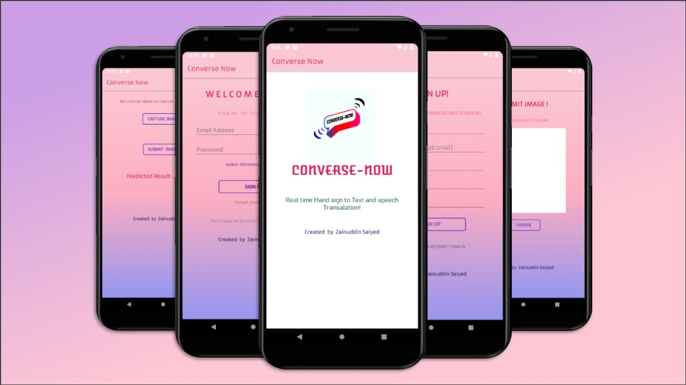
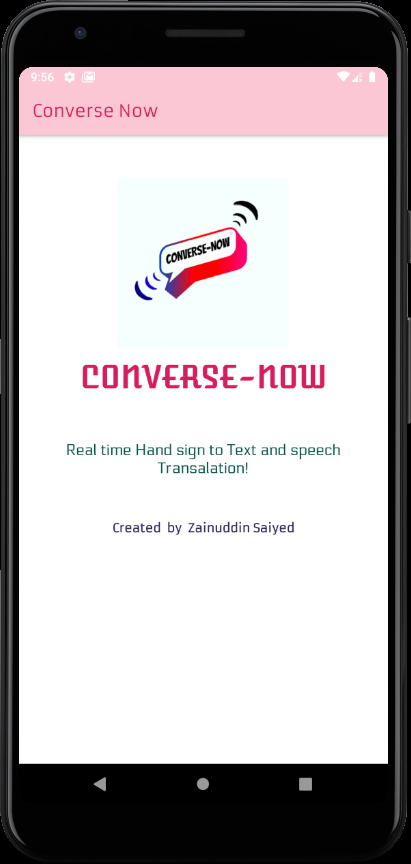
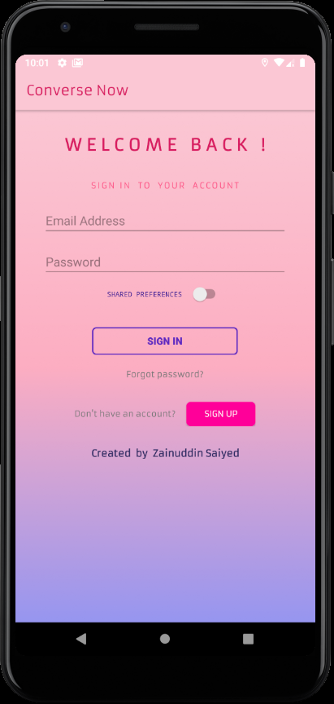
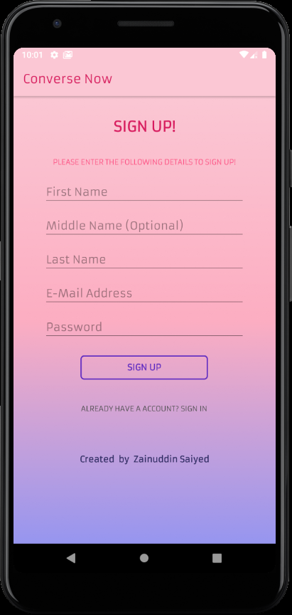
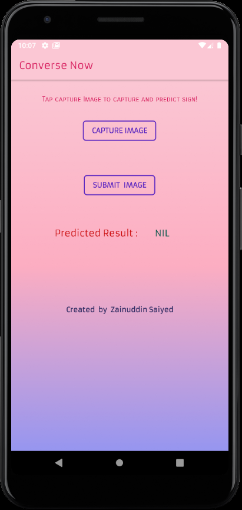
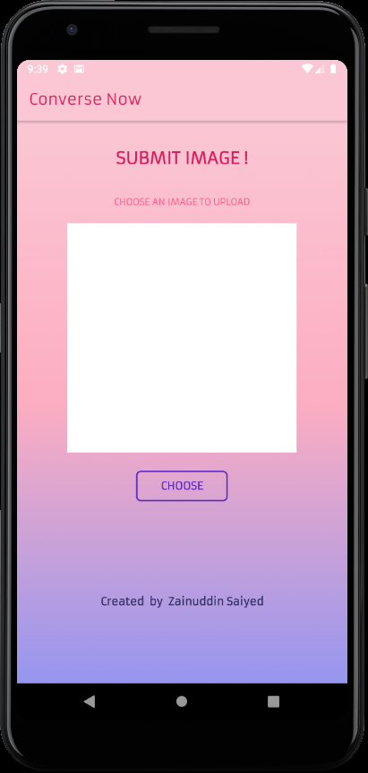

# Converse-Now
**UNDER DEVELOPMENT**
##Overview:
Converse-Now, is an android application which predicts a captured image containing a Hand Sign to its coresponding Alphabet, and also outputs the coresponding probability of prediction. This app will provide a interface which will bridge the gap between the differently abled and the common mass. Other features are that: users can also "Submit captured Images" to us, with which we can further optimize and improve the neural network model for better accuracy and predictions. The name Converse-Now actually implies to "Let's Communicate freely!" regardless of any barrier restricting them to converse. 
  

## Guide on app's UI :

1. The following Welcome screen appears for few seconds when the apps launcher icon is tapped.
  

  

 
2. If the user is new and haven't yet registered, then Tap "SIGN UP". Fill in the required details & hit Sign up button to get registered.
 

 
3. Enter your Log-In credentials to access app contents.
  

 
4. After Signing In, the Home page of app appears.
 

 
Here, Tap: Capture Image : To capture an image and to predict the alphabet it represents.
 Submit Image : To submit an image to us for further improving accuracy of predictions.
 
 
5. For Submiting data, First press "Choose" button to browse and select an Image. 
 

 And, the press UPLOAD to upload the image.
 A small Toast appears at the bottom after successfull upload of image.

## Repository Contents:

1. Android Application ( Converse Now app )
2. Python Notebooks ( IPy notebook(s) used for training the Neural Network )
3. App Screenshots. ( Images )
  

